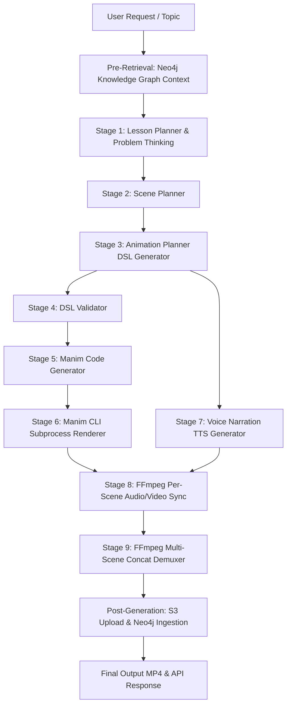
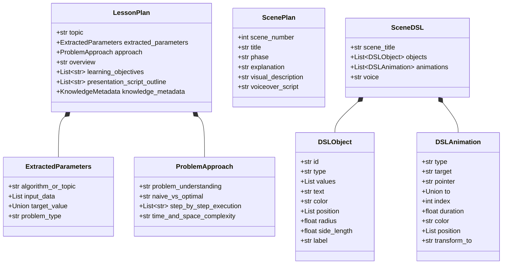
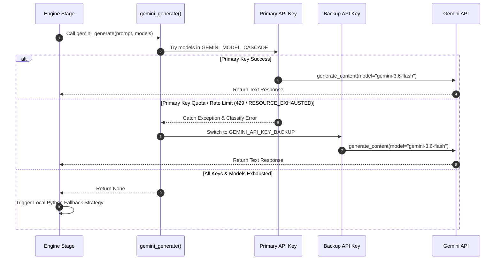

# System Core Architecture Documentation: AI Teaching Engine (`backend/engine`)

This document serves as the **authoritative technical reference** for the AI Teaching Engine pipeline located in [`backend/engine`](file:///c:/code-2026/Theoria%20AI/backend/engine). It details every architectural layer, execution stage, data schema, LLM cascade mechanism, rendering pipeline, error resilience policy, and service integration point.

---

## 1. System Overview & Architectural Purpose

The AI Teaching Engine is an autonomous pipeline designed to turn high-level educational topics (e.g., *"Explain Binary Search"*, *"Recursion on Binary Trees"*) or LeetCode-style algorithmic prompts into fully rendered, animated MP4 video lessons with voiceover narration.

Rather than generating raw Manim Python code directly from LLM prompts (which is highly prone to syntax errors, layout collisions, and invalid API calls), the engine uses a **multi-stage compiler design**:



### Core Architecture Principles:
1. **Decoupled Intermediate Representation (DSL)**: LLMs produce structured JSON ([`SceneDSL`](file:///c:/code-2026/Theoria%20AI/backend/engine/models.py#L59)), not Python code.
2. **Deterministic Translation**: Python code generation ([`ManimCodeGenerator`](file:///c:/code-2026/Theoria%20AI/backend/engine/manim_generator.py#L5)) is 100% programmatic and type-checked.
3. **Multi-Tier Fault Tolerance**: Every stage features deterministic local Python fallbacks in case of LLM quota exhaustion, validation failures, or CLI render errors.
4. **Resilient LLM Cascading**: Automatic model fallback and API key switching across Gemini models.

---

## 2. Directory Structure & File Map

| File Path | Component / Role | Core Classes & Functions |
|---|---|---|
| [`backend/engine/pipeline.py`](file:///c:/code-2026/Theoria%20AI/backend/engine/pipeline.py) | **Main Pipeline Orchestrator** | [`VideoPipeline`](file:///c:/code-2026/Theoria%20AI/backend/engine/pipeline.py#L21), [`generate_video`](file:///c:/code-2026/Theoria%20AI/backend/engine/pipeline.py#L136) |
| [`backend/engine/models.py`](file:///c:/code-2026/Theoria%20AI/backend/engine/models.py) | **Pydantic Schemas & Data Structures** | [`SceneDSL`](file:///c:/code-2026/Theoria%20AI/backend/engine/models.py#L59), [`DSLObject`](file:///c:/code-2026/Theoria%20AI/backend/engine/models.py#L35), [`DSLAnimation`](file:///c:/code-2026/Theoria%20AI/backend/engine/models.py#L47), [`LessonPlan`](file:///c:/code-2026/Theoria%20AI/backend/engine/models.py#L90), [`ScenePlan`](file:///c:/code-2026/Theoria%20AI/backend/engine/models.py#L101), [`ObjectType`](file:///c:/code-2026/Theoria%20AI/backend/engine/models.py#L15), [`AnimationType`](file:///c:/code-2026/Theoria%20AI/backend/engine/models.py#L24) |
| [`backend/engine/gemini_client.py`](file:///c:/code-2026/Theoria%20AI/backend/engine/gemini_client.py) | **LLM API Cascade & Key Rotator** | [`gemini_generate`](file:///c:/code-2026/Theoria%20AI/backend/engine/gemini_client.py#L37), [`_classify_error`](file:///c:/code-2026/Theoria%20AI/backend/engine/gemini_client.py#L25) |
| [`backend/engine/prompts.py`](file:///c:/code-2026/Theoria%20AI/backend/engine/prompts.py) | **Prompt Engineering & Schemas** | `LESSON_PLANNER_PROMPT`, `SCENE_PLANNER_PROMPT`, `ANIMATION_PLANNER_PROMPT` |
| [`backend/engine/lesson_planner.py`](file:///c:/code-2026/Theoria%20AI/backend/engine/lesson_planner.py) | **Stage 1: Educational Lesson Planner** | [`LessonPlanner`](file:///c:/code-2026/Theoria%20AI/backend/engine/lesson_planner.py#L56), [`_extract_params_from_topic`](file:///c:/code-2026/Theoria%20AI/backend/engine/lesson_planner.py#L18) |
| [`backend/engine/scene_planner.py`](file:///c:/code-2026/Theoria%20AI/backend/engine/scene_planner.py) | **Stage 2: Multi-Scene Script Planner** | [`ScenePlanner`](file:///c:/code-2026/Theoria%20AI/backend/engine/scene_planner.py#L11) |
| [`backend/engine/animation_planner.py`](file:///c:/code-2026/Theoria%20AI/backend/engine/animation_planner.py) | **Stage 3: Animation DSL Planner** | [`AnimationPlanner`](file:///c:/code-2026/Theoria%20AI/backend/engine/animation_planner.py#L12) |
| [`backend/engine/dsl_validator.py`](file:///c:/code-2026/Theoria%20AI/backend/engine/dsl_validator.py) | **Stage 4: DSL Structure & Safety Validator** | [`DSLValidator`](file:///c:/code-2026/Theoria%20AI/backend/engine/dsl_validator.py#L12), [`DSLValidationError`](file:///c:/code-2026/Theoria%20AI/backend/engine/dsl_validator.py#L5) |
| [`backend/engine/manim_generator.py`](file:///c:/code-2026/Theoria%20AI/backend/engine/manim_generator.py) | **Stage 5: DSL to Manim Python Compiler** | [`ManimCodeGenerator`](file:///c:/code-2026/Theoria%20AI/backend/engine/manim_generator.py#L5) |
| [`backend/engine/renderer.py`](file:///c:/code-2026/Theoria%20AI/backend/engine/renderer.py) | **Stage 6: Manim CLI Subprocess Renderer** | [`ManimRenderer`](file:///c:/code-2026/Theoria%20AI/backend/engine/renderer.py#L40) |
| [`backend/engine/narration.py`](file:///c:/code-2026/Theoria%20AI/backend/engine/narration.py) | **Stage 7: TTS Narration Audio Generator** | [`NarrationGenerator`](file:///c:/code-2026/Theoria%20AI/backend/engine/narration.py#L9) |
| [`backend/engine/ffmpeg_merge.py`](file:///c:/code-2026/Theoria%20AI/backend/engine/ffmpeg_merge.py) | **Stage 8 & 9: FFmpeg Audio/Video Synchronization & Concat** | [`FFmpegMerger`](file:///c:/code-2026/Theoria%20AI/backend/engine/ffmpeg_merge.py#L9) |
| [`backend/engine/main.py`](file:///c:/code-2026/Theoria%20AI/backend/engine/main.py) | **CLI Entrypoint & Test Harness** | [`main`](file:///c:/code-2026/Theoria%20AI/backend/engine/main.py#L58) |
| [`backend/app/services/engine_service.py`](file:///c:/code-2026/Theoria%20AI/backend/app/services/engine_service.py) | **FastAPI Integration Service** | [`process_video_generation`](file:///c:/code-2026/Theoria%20AI/backend/app/services/engine_service.py#L36) |
| [`backend/app/api/v1/endpoints/engine.py`](file:///c:/code-2026/Theoria%20AI/backend/app/api/v1/endpoints/engine.py) | **REST API Endpoints** | [`generate_video_endpoint`](file:///c:/code-2026/Theoria%20AI/backend/app/api/v1/endpoints/engine.py#L20) |

---

## 3. End-to-End Pipeline Execution Breakdown

The complete execution sequence is governed by [`VideoPipeline.run()`](file:///c:/code-2026/Theoria%20AI/backend/engine/pipeline.py#L34).

### Pre-Retrieval: Neo4j Knowledge Graph Context Injection
Before initiating LLM generation, [`VideoPipeline.run()`](file:///c:/code-2026/Theoria%20AI/backend/engine/pipeline.py#L43) queries the Neo4j database using `GraphService.get_graph_context_for_prompt(topic, user_id)`.
- If prerequisite concepts or related topics exist in the user's graph, the formatted context string is prepended to the Stage 1 LLM prompt.
- Handled gracefully inside a `try/except` block so failure to connect to Neo4j does not interrupt video generation.

### Stage 1: Lesson Planner & Deep Problem Thinking
- **Component**: [`LessonPlanner.plan_lesson(topic, graph_context)`](file:///c:/code-2026/Theoria%20AI/backend/engine/lesson_planner.py#L62)
- **Prompt**: `LESSON_PLANNER_PROMPT` in [`prompts.py`](file:///c:/code-2026/Theoria%20AI/backend/engine/prompts.py#L10)
- **Output Model**: [`LessonPlan`](file:///c:/code-2026/Theoria%20AI/backend/engine/models.py#L90)
- **Process**:
  1. Parses raw topic input to extract concrete parameters (`ExtractedParameters`): algorithm name, input data (e.g. `[1, 3, 5, 7, 9]`), target search value (e.g. `7`), problem classification.
  2. Formulates solution strategy (`ProblemApproach`): problem understanding, brute-force vs optimal approach comparison, step-by-step execution state transitions, time/space complexity analysis.
  3. Extracts educational metadata (`KnowledgeMetadata`): primary concept, concepts list, algorithms, data structures, prerequisites, related concepts, complexity array.
  4. Outlines high-level presentation script.
- **Fallback**: If LLM fails or produces malformed JSON, [`_extract_params_from_topic()`](file:///c:/code-2026/Theoria%20AI/backend/engine/lesson_planner.py#L18) uses regex to extract numbers and generates a default Binary Search / algorithm structured fallback plan.

### Stage 2: Scene Planner
- **Component**: [`ScenePlanner.plan_scenes(lesson_plan)`](file:///c:/code-2026/Theoria%20AI/backend/engine/scene_planner.py#L17)
- **Prompt**: `SCENE_PLANNER_PROMPT` in [`prompts.py`](file:///c:/code-2026/Theoria%20AI/backend/engine/prompts.py#L89)
- **Output Model**: `List[`[`ScenePlan`](file:///c:/code-2026/Theoria%20AI/backend/engine/models.py#L101)`]`
- **Process**: Breaks the overall lesson plan into chronological visual scenes (typically 3 scenes: *Problem Setup*, *Approach Walkthrough*, *Conclusion/Target Match*). Each scene defines:
  - `title`, `phase`, `explanation`, `visual_description`, `voiceover_script`
- **Fallback**: Structured 3-scene breakdown constructed directly from `lesson_plan.extracted_parameters`.

---

### Iterative Scene Execution Loop (Stages 3 to 8)
For each [`ScenePlan`](file:///c:/code-2026/Theoria%20AI/backend/engine/models.py#L101) in `scenes`, the pipeline executes Stages 3–8 sequentially:

#### Stage 3: Animation Planner (DSL Generation)
- **Component**: [`AnimationPlanner.plan_animation(scene_plan)`](file:///c:/code-2026/Theoria%20AI/backend/engine/animation_planner.py#L18)
- **Prompt**: `ANIMATION_PLANNER_PROMPT` in [`prompts.py`](file:///c:/code-2026/Theoria%20AI/backend/engine/prompts.py#L135)
- **Output Model**: [`SceneDSL`](file:///c:/code-2026/Theoria%20AI/backend/engine/models.py#L59)
- **Process**: Translates natural language scene descriptions into a declarative JSON object containing graphical object definitions (`DSLObject`) and sequential animations (`DSLAnimation`).
- **Fallback**: Constructs a default `SceneDSL` with array elements, target text, pointers, and fade/highlight animations.

#### Stage 4: DSL Validation
- **Component**: [`DSLValidator.validate(dsl)`](file:///c:/code-2026/Theoria%20AI/backend/engine/dsl_validator.py#L18)
- **Process**: Performs rigorous static analysis on the `SceneDSL` object:
  - Validates object types against allowed set ([`ObjectType`](file:///c:/code-2026/Theoria%20AI/backend/engine/models.py#L15): `circle`, `square`, `arrow`, `text`, `array`, `pointer`).
  - Checks for duplicate object IDs.
  - Ensures array objects declare a valid `values` list.
  - Validates animation types against allowed set ([`AnimationType`](file:///c:/code-2026/Theoria%20AI/backend/engine/models.py#L24): `Highlight`, `Move`, `Transform`, `FadeIn`, `FadeOut`, `Write`, `Wait`, `MovePointer`).
  - Checks target ID existence for single and transform animations.
  - Checks array index bounds for `Highlight` and `MovePointer` operations.
  - Ensures animation duration values are non-negative.
- **Error Handling**: Raises [`DSLValidationError`](file:///c:/code-2026/Theoria%20AI/backend/engine/dsl_validator.py#L5) if invalid; pipeline logs warnings and proceeds best-effort.

#### Stage 5: Manim Code Generation
- **Component**: [`ManimCodeGenerator.generate_code(dsl, scene_class_name="GeneratedScene")`](file:///c:/code-2026/Theoria%20AI/backend/engine/manim_generator.py#L8)
- **Output**: Python source code string defining a Manim `Scene` subclass (`class GeneratedScene(Scene)`).
- **Object Translation Matrix**:
  - `circle` $\rightarrow$ `Circle(radius=..., color=...)`
  - `square` $\rightarrow$ `Square(side_length=..., color=...)`
  - `text` $\rightarrow$ `Text("...", color=...)`
  - `arrow` $\rightarrow$ `Arrow(start=..., end=...)`
  - `pointer` $\rightarrow$ `VGroup(ptr_arrow, ptr_txt)`
  - `array` $\rightarrow$ Horizontally aligned `VGroup` of `Square` cells and `Text` labels stored in `array_elements[obj.id]`.
- **Animation Translation Matrix**:
  - `FadeIn` / `FadeOut` / `Write` $\rightarrow$ `self.play(FadeIn/FadeOut/Write(objects[target]))`
  - `Wait` $\rightarrow$ `self.wait(duration)`
  - `Move` $\rightarrow$ `self.play(objects[target].animate.move_to([...]))`
  - `Transform` $\rightarrow$ `self.play(Transform(objects[target], objects[transform_to]))`
  - `Highlight` $\rightarrow$ `self.play(Indicate(array_elements[target][index], color=...))`
  - `MovePointer` $\rightarrow$ Dynamically recalculates relative offset to target array cell using `next_to(target_cell, DOWN, buff=0.3)`.

#### Stage 6: Manim CLI Rendering
- **Component**: [`ManimRenderer.render(code_string, scene_class_name, quality="l", output_filename=...)`](file:///c:/code-2026/Theoria%20AI/backend/engine/renderer.py#L47)
- **Output**: Absolute file path to rendered raw MP4 video file.
- **Execution Mechanism**:
  1. Writes code string to a temporary script file (`scene.py`).
  2. Executes CLI command via `subprocess.run`:
     ```bash
     python -m manim -ql --format=mp4 --media_dir <tmpdir> <script_path> GeneratedScene
     ```
  3. Locates output `.mp4` file and copies to `backend/output/manim_raw_scene_{scene_number}.mp4`.
- **3-Tier Render Fallback Strategy**:
  - *Tier 1*: Primary generated Manim code compilation.
  - *Tier 2*: If primary fails, compiles [`DEFAULT_FALLBACK_MANIM`](file:///c:/code-2026/Theoria%20AI/backend/engine/renderer.py#L12) (pre-tested Manim array scene).
  - *Tier 3*: If Manim CLI missing or fatal error, uses FFmpeg `lavfi` color filter to generate a sleek dark background (`#121212`) 5-second fallback video.

#### Stage 7: Narration Generation (TTS)
- **Component**: [`NarrationGenerator.generate_narration(voice_text, filename=...)`](file:///c:/code-2026/Theoria%20AI/backend/engine/narration.py#L16)
- **Output**: Absolute file path to generated MP3 audio file.
- **Mechanism**: Synthesizes `dsl.voice` text to speech using `gTTS(text=voice_text, lang='en')`.
- **Fallback**: If `gTTS` fails or loses internet access, invokes FFmpeg `anullsrc` filter to generate a 5-second silent audio file (`libmp3lame`).

#### Stage 8: Per-Scene Audio/Video Merging
- **Component**: [`FFmpegMerger.merge(video_path, audio_path, output_filename=...)`](file:///c:/code-2026/Theoria%20AI/backend/engine/ffmpeg_merge.py#L16)
- **Output**: Absolute file path to `merged_scene_{scene_number}.mp4`.
- **FFmpeg Command**:
  ```bash
  ffmpeg -y -i <video_path> -i <audio_path> -c:v copy -c:a aac -shortest <merged_path>
  ```
- **Fallback**: If merging fails, copies raw video directly to output path.

---

### Stage 9: Final Multi-Scene Video Concatenation
- **Component**: [`FFmpegMerger.concat_videos(scene_videos, output_filename="final.mp4")`](file:///c:/code-2026/Theoria%20AI/backend/engine/ffmpeg_merge.py#L78)
- **Output**: Absolute path to combined video `output/final.mp4`.
- **Mechanism**: Writes scene file paths to `concat_list.txt` and executes FFmpeg demuxer:
  ```bash
  ffmpeg -y -f concat -safe 0 -i concat_list.txt -c copy output/final.mp4
  ```
- **Cleanup**: Automatically deletes `concat_list.txt` upon completion.

### Post-Generation Ingestion & S3 Sync
When invoked through FastAPI service [`process_video_generation`](file:///c:/code-2026/Theoria%20AI/backend/app/services/engine_service.py#L36):
1. **S3 Upload**: Uploads `final.mp4` to S3 bucket (`videos/user_{id}_vid_{vid_id}.mp4`) via [`s3_service`](file:///c:/code-2026/Theoria%20AI/backend/app/services/s3_service.py) if configured.
2. **Database Record**: Updates `VideoGeneration` record status to `completed`, saving extracted parameters, solution approach, intermediate DSL JSON, and generated Manim Python code.
3. **Knowledge Graph Ingestion**: Ingests educational concept metadata (`KnowledgeMetadata`) into Neo4j graph via `GraphService.ingest_knowledge_metadata(...)`.

---

## 4. Schemas & Data Contract Specifications

All engine data models are defined using Pydantic in [`backend/engine/models.py`](file:///c:/code-2026/Theoria%20AI/backend/engine/models.py).



---

## 5. Gemini Cascade Resilience & Failover Logic

The engine interacts with the Gemini API through a custom client wrapper in [`backend/engine/gemini_client.py`](file:///c:/code-2026/Theoria%20AI/backend/engine/gemini_client.py).



### Model Cascade Configuration ([`models.py`](file:///c:/code-2026/Theoria%20AI/backend/engine/models.py#L8)):
- Default cascade sequence: `["gemini-3.6-flash", "gemini-2.0-flash", "gemini-flash-latest"]`.
- Overridable via `GEMINI_MODELS` environment variable.
- Key fallback supports `GEMINI_API_KEY` and `GEMINI_API_KEY_BACKUP`.
- [`_classify_error`](file:///c:/code-2026/Theoria%20AI/backend/engine/gemini_client.py#L25) parses error strings to diagnose quota exhaustion (429), unlisted models (404), or invalid API credentials (401/403).

---

## 6. How to Modify or Extend the Engine Architecture

If you need to make changes to the engine architecture, follow these guidelines to preserve pipeline stability and backward compatibility:

### Adding a New Visual Object Type to Manim DSL
1. **Update Enum**: Add new type string to [`ObjectType`](file:///c:/code-2026/Theoria%20AI/backend/engine/models.py#L15) in `models.py`.
2. **Update Schema**: Add required properties to [`DSLObject`](file:///c:/code-2026/Theoria%20AI/backend/engine/models.py#L35) in `models.py`.
3. **Update Validator**: Add validation constraints to [`DSLValidator.validate()`](file:///c:/code-2026/Theoria%20AI/backend/engine/dsl_validator.py#L32) in `dsl_validator.py`.
4. **Update Code Generator**: Implement Manim Python code generation branch in [`ManimCodeGenerator.generate_code()`](file:///c:/code-2026/Theoria%20AI/backend/engine/manim_generator.py#L30) in `manim_generator.py`.
5. **Update Prompt Instructions**: Add the object specification to `ANIMATION_PLANNER_PROMPT` in [`prompts.py`](file:///c:/code-2026/Theoria%20AI/backend/engine/prompts.py#L145).

### Adding a New Animation Type
1. **Update Enum**: Add animation name to [`AnimationType`](file:///c:/code-2026/Theoria%20AI/backend/engine/models.py#L24) in `models.py`.
2. **Update Schema**: Add animation parameters to [`DSLAnimation`](file:///c:/code-2026/Theoria%20AI/backend/engine/models.py#L47) in `models.py`.
3. **Update Validator**: Update `ALLOWED_ANIMATION_TYPES` and Target ID verification in [`DSLValidator`](file:///c:/code-2026/Theoria%20AI/backend/engine/dsl_validator.py#L53).
4. **Update Code Generator**: Append animation code generation logic in [`ManimCodeGenerator`](file:///c:/code-2026/Theoria%20AI/backend/engine/manim_generator.py#L96).
5. **Update Prompt Instructions**: Register the animation syntax in `ANIMATION_PLANNER_PROMPT` in [`prompts.py`](file:///c:/code-2026/Theoria%20AI/backend/engine/prompts.py#L153).

### Modifying the LLM Model Sequence
Modify `.env` in the backend directory:
```env
GEMINI_MODELS=gemini-3.6-flash,gemini-2.0-flash,gemini-flash-latest
GEMINI_API_KEY=your_primary_api_key
GEMINI_API_KEY_BACKUP=your_backup_api_key
```

---

## 7. Testing & Verification

### Running the Standalone CLI Test Harness
Execute `main.py` directly from the `backend` directory:
```bash
# Windows PowerShell
cd "c:\code-2026\Theoria AI\backend"
python -m engine.main "Explain Binary Search for target 7 in array [1, 3, 5, 7, 9]"
```

### Running Backend Unit Tests
Execute pytest suite for engine components:
```bash
cd "c:\code-2026\Theoria AI\backend"
pytest tests/ -v
```

---

## 8. Summary Checklist for Architectural Compliance

When modifying any component within `@engine`:
- [ ] Maintain **strict separation** between LLM output parsing (DSL JSON) and Manim Python code generation.
- [ ] Ensure all LLM prompts enforce **strict JSON schema outputs** without markdown text wrapping.
- [ ] Always provide a **deterministic local Python fallback** in planners to guard against API quota limits.
- [ ] Keep file links updated in documentation relative to repository paths.
- [ ] Run both CLI test harness and backend API endpoint tests after making core changes.
