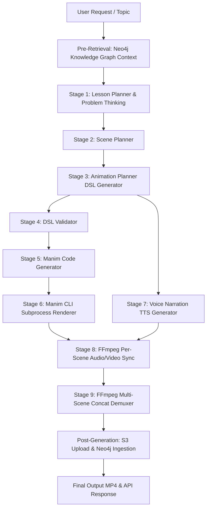

# AI Teaching Engine Architecture & Pipeline Reference (`@engine`)

> **Note**: This is the localized copy of the system architecture document for the `@engine` directory. The master architecture document is maintained at [`SYSTEM_CORE_ARCHITECTURE.md`](file:///c:/code-2026/Theoria%20AI/SYSTEM_CORE_ARCHITECTURE.md).

---

## 1. System Overview & Architectural Purpose

The AI Teaching Engine is an autonomous pipeline located in `backend/engine/` designed to turn high-level educational topics (e.g., *"Explain Binary Search"*, *"Recursion on Binary Trees"*) or LeetCode-style algorithmic prompts into fully rendered, animated MP4 video lessons with voiceover narration.

Rather than generating raw Manim Python code directly from LLM prompts (which is highly prone to syntax errors, layout collisions, and invalid API calls), the engine uses a **multi-stage compiler design**:

---

## 2. File Map & Code Locations

| File Path | Component / Role | Core Classes & Functions |
|---|---|---|
| [`pipeline.py`](file:///c:/code-2026/Theoria%20AI/backend/engine/pipeline.py) | **Main Pipeline Orchestrator** | [`VideoPipeline`](file:///c:/code-2026/Theoria%20AI/backend/engine/pipeline.py#L21), [`generate_video`](file:///c:/code-2026/Theoria%20AI/backend/engine/pipeline.py#L136) |
| [`models.py`](file:///c:/code-2026/Theoria%20AI/backend/engine/models.py) | **Pydantic Schemas & Data Structures** | [`SceneDSL`](file:///c:/code-2026/Theoria%20AI/backend/engine/models.py#L59), [`DSLObject`](file:///c:/code-2026/Theoria%20AI/backend/engine/models.py#L35), [`DSLAnimation`](file:///c:/code-2026/Theoria%20AI/backend/engine/models.py#L47), [`LessonPlan`](file:///c:/code-2026/Theoria%20AI/backend/engine/models.py#L90), [`ScenePlan`](file:///c:/code-2026/Theoria%20AI/backend/engine/models.py#L101), [`ObjectType`](file:///c:/code-2026/Theoria%20AI/backend/engine/models.py#L15), [`AnimationType`](file:///c:/code-2026/Theoria%20AI/backend/engine/models.py#L24) |
| [`gemini_client.py`](file:///c:/code-2026/Theoria%20AI/backend/engine/gemini_client.py) | **LLM API Cascade & Key Rotator** | [`gemini_generate`](file:///c:/code-2026/Theoria%20AI/backend/engine/gemini_client.py#L37), [`_classify_error`](file:///c:/code-2026/Theoria%20AI/backend/engine/gemini_client.py#L25) |
| [`prompts.py`](file:///c:/code-2026/Theoria%20AI/backend/engine/prompts.py) | **Prompt Engineering & Schemas** | `LESSON_PLANNER_PROMPT`, `SCENE_PLANNER_PROMPT`, `ANIMATION_PLANNER_PROMPT` |
| [`lesson_planner.py`](file:///c:/code-2026/Theoria%20AI/backend/engine/lesson_planner.py) | **Stage 1: Educational Lesson Planner** | [`LessonPlanner`](file:///c:/code-2026/Theoria%20AI/backend/engine/lesson_planner.py#L56), [`_extract_params_from_topic`](file:///c:/code-2026/Theoria%20AI/backend/engine/lesson_planner.py#L18) |
| [`scene_planner.py`](file:///c:/code-2026/Theoria%20AI/backend/engine/scene_planner.py) | **Stage 2: Multi-Scene Script Planner** | [`ScenePlanner`](file:///c:/code-2026/Theoria%20AI/backend/engine/scene_planner.py#L11) |
| [`animation_planner.py`](file:///c:/code-2026/Theoria%20AI/backend/engine/animation_planner.py) | **Stage 3: Animation DSL Planner** | [`AnimationPlanner`](file:///c:/code-2026/Theoria%20AI/backend/engine/animation_planner.py#L12) |
| [`dsl_validator.py`](file:///c:/code-2026/Theoria%20AI/backend/engine/dsl_validator.py) | **Stage 4: DSL Structure & Safety Validator** | [`DSLValidator`](file:///c:/code-2026/Theoria%20AI/backend/engine/dsl_validator.py#L12), [`DSLValidationError`](file:///c:/code-2026/Theoria%20AI/backend/engine/dsl_validator.py#L5) |
| [`manim_generator.py`](file:///c:/code-2026/Theoria%20AI/backend/engine/manim_generator.py) | **Stage 5: DSL to Manim Python Compiler** | [`ManimCodeGenerator`](file:///c:/code-2026/Theoria%20AI/backend/engine/manim_generator.py#L5) |
| [`renderer.py`](file:///c:/code-2026/Theoria%20AI/backend/engine/renderer.py) | **Stage 6: Manim CLI Subprocess Renderer** | [`ManimRenderer`](file:///c:/code-2026/Theoria%20AI/backend/engine/renderer.py#L40) |
| [`narration.py`](file:///c:/code-2026/Theoria%20AI/backend/engine/narration.py) | **Stage 7: TTS Narration Audio Generator** | [`NarrationGenerator`](file:///c:/code-2026/Theoria%20AI/backend/engine/narration.py#L9) |
| [`ffmpeg_merge.py`](file:///c:/code-2026/Theoria%20AI/backend/engine/ffmpeg_merge.py) | **Stage 8 & 9: FFmpeg Audio/Video Sync & Concat** | [`FFmpegMerger`](file:///c:/code-2026/Theoria%20AI/backend/engine/ffmpeg_merge.py#L9) |
| [`main.py`](file:///c:/code-2026/Theoria%20AI/backend/engine/main.py) | **CLI Entrypoint & Test Harness** | [`main`](file:///c:/code-2026/Theoria%20AI/backend/engine/main.py#L58) |

---

## 3. End-to-End Pipeline Execution Breakdown

The complete execution sequence is governed by [`VideoPipeline.run()`](file:///c:/code-2026/Theoria%20AI/backend/engine/pipeline.py#L34).

### Pre-Retrieval: Neo4j Knowledge Graph Context Injection
Before initiating LLM generation, [`VideoPipeline.run()`](file:///c:/code-2026/Theoria%20AI/backend/engine/pipeline.py#L43) queries Neo4j via `GraphService.get_graph_context_for_prompt(topic, user_id)` to retrieve concept prerequisites and context.

### Stage 1: Lesson Planner & Deep Problem Thinking
- **Component**: [`LessonPlanner.plan_lesson(topic, graph_context)`](file:///c:/code-2026/Theoria%20AI/backend/engine/lesson_planner.py#L62)
- **Prompt**: `LESSON_PLANNER_PROMPT` in [`prompts.py`](file:///c:/code-2026/Theoria%20AI/backend/engine/prompts.py#L10)
- **Output Model**: [`LessonPlan`](file:///c:/code-2026/Theoria%20AI/backend/engine/models.py#L90)
- **Fallback**: [`_extract_params_from_topic()`](file:///c:/code-2026/Theoria%20AI/backend/engine/lesson_planner.py#L18) regex parameter extractor.

### Stage 2: Scene Planner
- **Component**: [`ScenePlanner.plan_scenes(lesson_plan)`](file:///c:/code-2026/Theoria%20AI/backend/engine/scene_planner.py#L17)
- **Output Model**: `List[`[`ScenePlan`](file:///c:/code-2026/Theoria%20AI/backend/engine/models.py#L101)`]`

### Stage 3: Animation Planner (DSL Generation)
- **Component**: [`AnimationPlanner.plan_animation(scene_plan)`](file:///c:/code-2026/Theoria%20AI/backend/engine/animation_planner.py#L18)
- **Output Model**: [`SceneDSL`](file:///c:/code-2026/Theoria%20AI/backend/engine/models.py#L59)

### Stage 4: DSL Validation
- **Component**: [`DSLValidator.validate(dsl)`](file:///c:/code-2026/Theoria%20AI/backend/engine/dsl_validator.py#L18)

### Stage 5: Manim Code Generation
- **Component**: [`ManimCodeGenerator.generate_code(dsl)`](file:///c:/code-2026/Theoria%20AI/backend/engine/manim_generator.py#L8)

### Stage 6: Manim CLI Rendering
- **Component**: [`ManimRenderer.render(...)`](file:///c:/code-2026/Theoria%20AI/backend/engine/renderer.py#L47)
- **3-Tier Fallback**: Generated Manim code $\rightarrow$ Default fallback Manim scene $\rightarrow$ FFmpeg dark canvas.

### Stage 7: Narration Generation (TTS)
- **Component**: [`NarrationGenerator.generate_narration(...)`](file:///c:/code-2026/Theoria%20AI/backend/engine/narration.py#L16)
- **Fallback**: FFmpeg silence generator.

### Stage 8 & 9: Per-Scene Merging & Final Concatenation
- **Component**: [`FFmpegMerger.merge(...)`](file:///c:/code-2026/Theoria%20AI/backend/engine/ffmpeg_merge.py#L16) and [`FFmpegMerger.concat_videos(...)`](file:///c:/code-2026/Theoria%20AI/backend/engine/ffmpeg_merge.py#L78)

---

## 4. How to Extend the Engine

1. **New Visual Object**: Add to [`ObjectType`](file:///c:/code-2026/Theoria%20AI/backend/engine/models.py#L15), [`DSLObject`](file:///c:/code-2026/Theoria%20AI/backend/engine/models.py#L35), [`DSLValidator`](file:///c:/code-2026/Theoria%20AI/backend/engine/dsl_validator.py#L32), [`ManimCodeGenerator`](file:///c:/code-2026/Theoria%20AI/backend/engine/manim_generator.py#L30), and `ANIMATION_PLANNER_PROMPT` in [`prompts.py`](file:///c:/code-2026/Theoria%20AI/backend/engine/prompts.py#L145).
2. **New Animation**: Add to [`AnimationType`](file:///c:/code-2026/Theoria%20AI/backend/engine/models.py#L24), [`DSLAnimation`](file:///c:/code-2026/Theoria%20AI/backend/engine/models.py#L47), [`DSLValidator`](file:///c:/code-2026/Theoria%20AI/backend/engine/dsl_validator.py#L53), [`ManimCodeGenerator`](file:///c:/code-2026/Theoria%20AI/backend/engine/manim_generator.py#L96), and `ANIMATION_PLANNER_PROMPT`.
