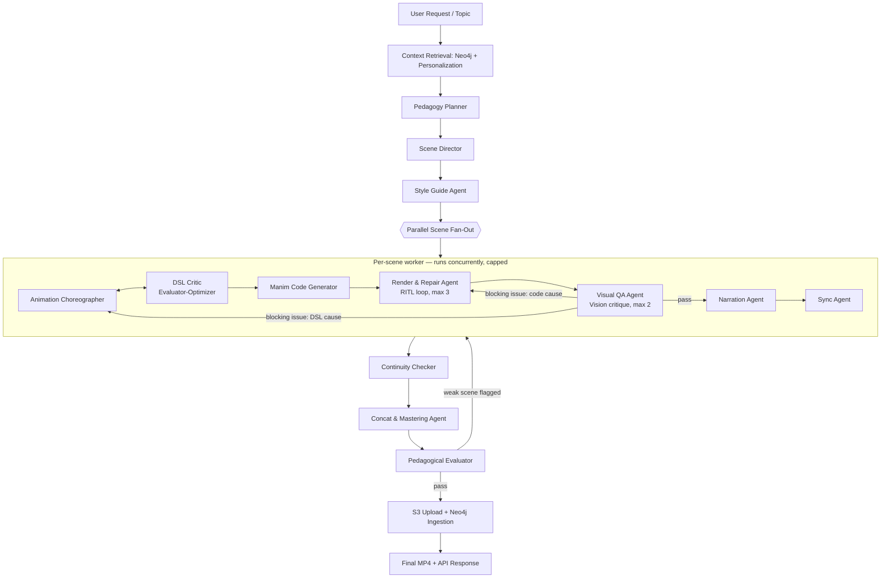

# AI Teaching Engine — Multi-Agent Evolution Blueprint (v2)

**Companion to:** `System Core Architecture Documentation: AI Teaching Engine (backend/engine)`
**Scope:** `backend/engine/*`, `backend/app/services/engine_service.py`, `backend/app/api/v1/endpoints/engine.py`
**Audience:** a coding agent (Claude Code / Cursor / Devin-style agent) implementing this incrementally against the existing repo.
**Status of current system:** working in production. Nothing here should be read as "rip and replace." Every phase in §8 is additive and independently shippable.

---

## 0. How to use this document

This is written to be pasted into a coding-agent session as the working spec. Each numbered section is close to a self-contained PR. Read **§8 Migration Roadmap** first — it tells you the order to build things in, because some phases (parallelization) pay for themselves immediately and de-risk the later ones (full orchestration migration). Don't jump straight to "build 15 agents"; that's the last phase, not the first.

Where this doc references existing code it uses the same file paths and class names as the current architecture doc (`VideoPipeline`, `LessonPlanner`, `SceneDSL`, etc.) so diffs stay traceable.

---

## 1. Where this project already wins — and where it's leaving value on the table

Text-to-Manim is a crowded space now, not a novel idea. There are open-source and hosted tools (Generative Manim, Animo, ManimAI/Manimate-style products, `manimator`, `Math-To-Manim`) that all do roughly the same core trick: natural language → LLM → Manim Python → render. Most of them are effectively single-shot: one prompt in, one script out, maybe a retry if it crashes.

**This project is structurally ahead of that category already**, because it doesn't generate Manim code directly from a topic — it runs the topic through a *pedagogical* compiler first:

- `LessonPlanner` extracts parameters and builds a problem-understanding / naive-vs-optimal / complexity analysis before any visuals are considered.
- `ScenePlanner` breaks that into a teaching sequence, not just an animation sequence.
- The `SceneDSL` intermediate representation decouples "what to say and show" from "how to draw it," which is exactly the kind of separation the more advanced research prototypes (e.g. `Math-To-Manim`, which explicitly works backward from what the learner needs to know before generating any animation) converge on independently.
- Neo4j-backed prerequisite/concept tracking is a real, defensible moat — none of the consumer tools above have a persistent learner model.

**Where competitors are catching up or already ahead:** the newer research systems in this space (`manim-trainer`'s Renderer-in-the-Loop / RITL agentic inference strategy, and hobby projects like "Kokoro Manim Voiceover" built around a code-writer/code-reviewer feedback loop) have already normalized *closing the loop* between the renderer and the code generator — i.e., treating a render failure as a signal fed back into generation, not just a trigger for a canned fallback. Your current renderer has three fallback **tiers**, but none of them are a *repair* loop — Tier 2 and Tier 3 are static, pre-written escape hatches, not attempts to fix the actual generated scene. That's the single highest-leverage gap to close (§4).

**The honest gap list, in priority order:**

1. No feedback loop between render failure and code generation (self-healing). Errors are caught, not learned from, per-attempt.
2. Scenes are generated and rendered **sequentially** even though they are independent by construction (`for each ScenePlan in scenes: run stages 3–8`). This is the cheapest possible win — no LLM/agent changes required, just concurrency.
3. Nothing ever looks at the rendered output. `DSLValidator` checks structure, not pixels. A scene can be structurally valid JSON and still render with overlapping text, an object off-canvas, or a pointer sitting on the wrong array index.
4. TTS is `gTTS` — functional, robotic, and a noticeable quality ceiling next to voice-cloned or neural competitors.
5. The Neo4j knowledge graph is populated (write path exists) but not yet **used** to shape a specific learner's lesson (no read-time personalization).
6. No caching — every request re-runs the full LLM cascade even for near-duplicate topics ("Explain Binary Search" vs "explain binary search algorithm").
7. No automated quality evaluation of the pedagogical output itself (only structural/technical validation).
8. No observability: no golden eval set, no regression detection when you change a prompt or swap a Gemini model in the cascade.

Everything below is designed to close these eight gaps, roughly in order of ROI ÷ effort.

---

## 2. Design principle: use multi-agent where it actually helps, not everywhere

It's tempting to turn every stage into "an agent" for its own sake. Don't. Anthropic's own applied research on this is unambiguous on the failure mode: multi-agent systems are the right tool for **breadth-first, parallelizable, loosely-coupled** work, and a worse tool for **tightly interdependent** generation chains — their public writeup on building a multi-agent research system explicitly calls out that this architecture style is well suited to parallel exploration but less effective for tasks like coding, where each step depends tightly on the last. It also documents that multi-agent orchestration burns roughly an order of magnitude more tokens than a single agent, and that in their internal benchmarks, **token usage alone explained ~80% of the variance in task performance** — meaning the gains come from giving reasoning more room to run in parallel, not from some inherent cleverness of having "more agents."

So the architecture below is deliberately hybrid:

| Where the work is... | Pattern to use | Why |
|---|---|---|
| Independent (3 scenes that don't depend on each other) | **Parallelization** (fan-out/fan-in) | Free speedup, no coordination cost. This is Anthropic's simplest documented pattern and the highest ROI item in this whole doc. |
| Tightly coupled, sequential-by-nature (lesson plan → scenes → DSL → code) | **Prompt chaining** (what you already have) — keep it | Rewriting this into a "swarm" would only add token cost and non-determinism for a process that's inherently a pipeline. |
| Generation with a *checkable* correctness signal (does the code compile/run? does the DSL validate?) | **Evaluator–Optimizer loop** with a bounded retry budget | This is the formal name for what a self-healing render loop is. Proven pattern, proven in this exact domain (RITL). |
| A step where the right subtask isn't knowable in advance (e.g. "what's actually wrong with this rendered frame?") | **Orchestrator–worker with a verification subagent** | Anthropic's own guidance calls the verification-subagent pattern "consistently works well across domains" — a dedicated agent whose only job is to check the main agent's work, separate from the agent that produced it. |
| Deciding what the learner needs, at what depth | **Routing** off the Neo4j graph state | Cheap, deterministic, no need for an LLM to decide this dynamically. |

Translated: you're not building "15 autonomous agents negotiating with each other." You're building **one deterministic orchestration graph** (a state machine, not a free-roaming swarm) where a handful of nodes are single LLM calls (as today), a handful are evaluator-optimizer loops with a hard iteration cap, and exactly one stage (per-scene generation/render) is parallelized. This keeps the system auditable, keeps cost bounded, and keeps debugging tractable — all things the current design already has going for it and shouldn't lose.

---

## 3. Orchestration engine: recommendation

Replace the imperative `VideoPipeline.run()` method with a **LangGraph `StateGraph`**, not a full agent framework, and not a rewrite into a different language/runtime.

Rationale, weighed against the realistic alternatives for a Python/FastAPI backend in 2026:

- **LangGraph** — explicit graph with conditional edges, built-in checkpointing (a render can crash halfway through scene 3 of 3 and resume, instead of re-running the whole pipeline), and the lowest token/coordination overhead of the mainstream frameworks because routing is code (`if/else`), not an LLM negotiating with itself. This maps almost 1:1 onto the existing mermaid flowchart in the current architecture doc — each pipeline stage becomes a node, each fallback branch becomes a conditional edge. **Use this as the backbone.**
- **CrewAI** — faster to prototype, but role-based agents negotiate coordination via additional LLM calls, which independent 2026 benchmarks put at up to 3x the token cost of LangGraph for comparable workflows, and it trades away the auditability you want for something that renders paid GPU time. Not recommended as the backbone; fine for a quick spike, not for the render pipeline itself.
- **Claude Agent SDK** — very strong fit specifically for the *code generation + repair* sub-loop (§4), since it's built around exactly that tool-use-in-a-loop shape, with permissioned tool access and hooks. Recommendation: use it (or an equivalent lightweight ReAct loop) **inside** the Render & Repair node, not as the top-level orchestrator. Don't run two different agent runtimes for the whole system.
- **AutoGen / Semantic Kernel** — both moved to maintenance mode in 2026 in favor of Microsoft's unified Agent Framework. Not recommended for a new build.

**Net recommendation:** LangGraph `StateGraph` as the top-level orchestrator (replacing `VideoPipeline.run`), with a small Claude-Agent-SDK-style tool loop embedded specifically inside the Render & Repair node. Everything else stays a normal async Python function call, exactly like today — you are not obligated to make every stage "agentic" just because the orchestrator changed.

---

## 4. The single highest-value change: Renderer-in-the-Loop (self-healing code generation)

This directly targets gap #1 and is the one change that will most visibly separate this product from "yet another text-to-Manim wrapper." It's a proven pattern — 2026 research on Manim-specific code generation (the `manim-trainer` / RITL work, evaluated against the public `ManimBench` dataset) frames Manim as a uniquely good fit for this because **the renderer itself is a deterministic verifier: the code either compiles and runs, or it doesn't.** That's a free, zero-cost-to-build correctness signal most code-generation domains don't get.

### 4.1 New component: `backend/engine/repair_agent.py`

```python
class RenderRepairAgent:
    """
    Evaluator-Optimizer loop wrapping ManimCodeGenerator + ManimRenderer.
    Replaces the current 'generate once, fall back to static tier on failure' behavior.
    """
    MAX_REPAIR_ATTEMPTS = 3  # empirically the point of diminishing returns in
                             # published iterative-repair studies; most gains land
                             # in the first two rounds.

    async def render_with_repair(self, dsl: SceneDSL, scene_number: int) -> RenderResult:
        code = self.code_generator.generate_code(dsl)
        for attempt in range(1, self.MAX_REPAIR_ATTEMPTS + 1):
            result = await self.renderer.render(code, scene_class_name="GeneratedScene")
            if result.success:
                self._log_repair_transcript(scene_number, attempt, code, result, outcome="success")
                return result

            error = self._classify_error(result.stderr)
            # error.kind in {"syntax", "manim_api_misuse", "geometry_out_of_bounds",
            #                "timeout", "missing_asset", "unknown"}
            code = await self._repair(dsl=dsl, prior_code=code, error=error)
            self._log_repair_transcript(scene_number, attempt, code, result, outcome="repair_attempted")

        # Exhausted repair budget -> fall through to the EXISTING Tier 2/3 fallback.
        # Do not remove the existing fallback tiers; they remain the safety net.
        return await self.renderer.render_with_static_fallback(dsl, scene_number)
```

Key implementation notes for whoever builds this:

- **Feed the actual `stderr`/traceback back into the prompt**, not a generic "fix the code" instruction — published self-repair studies are consistent that the size of the correctness gain is bottlenecked by feedback quality; a raw traceback beats a vague instruction by a wide margin.
- **Classify the error before repairing.** A Manim `IndexError` from an out-of-bounds array highlight is a *DSL* problem (the Choreographer picked a bad index), not a code-gen problem — route that back to the Animation Choreographer (§5), not the code generator, or you'll just regenerate the same bug in different syntax.
- **Log every repair transcript** (`dsl_before`, `code_before`, `error`, `code_after`, `outcome`) to a table (`repair_transcripts`) from day one. This becomes a proprietary training/RAG asset: once you have a few hundred successful repairs, you can retrieve similar past fixes as few-shot examples for new failures (a documented technique for boosting repair success rate on models too small/cheap to reliably self-repair from scratch), and eventually it's a fine-tuning dataset unique to your product.
- Hard-cap attempts. Every published implementation of this pattern enforces a fixed ceiling to prevent oscillation (a repair that fixes one thing and breaks another, forever). Three is the field-standard default; make it configurable but don't remove the cap.

### 4.2 Data contract addition (`models.py`)

```python
class RenderError(BaseModel):
    kind: Literal["syntax", "manim_api_misuse", "geometry_out_of_bounds",
                   "timeout", "missing_asset", "unknown"]
    raw_stderr: str
    suspected_source: Literal["code_generator", "dsl", "renderer_env"]

class RepairTranscript(BaseModel):
    scene_number: int
    attempt: int
    dsl_snapshot: SceneDSL
    code_before: str
    error: RenderError
    code_after: Optional[str]
    outcome: Literal["success", "repair_attempted", "budget_exhausted"]
    timestamp: datetime
```

---

## 5. Visual QA Agent (new — closes gap #3)

No stage in the current pipeline ever looks at a rendered pixel. `DSLValidator` catches structurally invalid JSON (bad IDs, out-of-range array index) but cannot catch "the pointer arrow renders on top of the text label" or "the array is wider than the frame at 9 elements." This is a well-established pattern now in adjacent domains — vision-critic loops that render, screenshot, and hand the frame to a vision-capable model for structured critique are standard practice in UI-generation and 3D-scene-generation agents (e.g. the critic-agent / verification-agent pair used in recent LLM-driven 3D scene work: render from a few angles or frames, submit to a vision model, get back a list of concrete mismatches, patch, re-render, re-verify).

### 5.1 New component: `backend/engine/visual_qa_agent.py`

Pipeline for each rendered scene, **after** Stage 6 succeeds (repaired or not):

1. Extract 3–4 keyframes via `ffmpeg -ss ... -frames:v 1` at even intervals through the scene (start, mid-highlight, mid-pointer-move, end).
2. Send frames + the scene's `SceneDSL` (so the critic knows *intent*, not just pixels) to a vision-capable model with a fixed, structured rubric — not an open-ended "does this look good?":
   - Are all objects fully inside the frame bounds?
   - Does any text overlap another element?
   - Is text legible against its background (basic contrast check)?
   - Does the highlighted/pointed-to array index visually match the `index` the DSL specified?
   - Is anything that should be visible (per `objects`) actually rendered, and is anything that should have faded out (per `animations`) actually gone by scene end?
3. Return a structured `VisualQAReport`, not prose:

```python
class VisualQAReport(BaseModel):
    scene_number: int
    passed: bool
    issues: List[VisualIssue]  # each with: description, likely_cause ("dsl" | "code_gen" | "renderer"),
                                # suggested_fix, severity ("blocking" | "cosmetic")

class VisualIssue(BaseModel):
    description: str
    likely_cause: Literal["dsl", "code_gen", "renderer"]
    suggested_fix: str
    severity: Literal["blocking", "cosmetic"]
```

4. **Routing on failure:** `blocking` issues route back into the Render & Repair loop (§4) if `likely_cause == "code_gen"`, or back to the Animation Choreographer (§6) if `likely_cause == "dsl"` — with the `VisualQAReport` injected as context, so the choreographer isn't guessing what to change. `cosmetic` issues are logged but don't block — ship the scene, fix in the next generation of the prompt library.
5. Same iteration cap discipline as §4: 2 visual-QA repair rounds max, then ship what you have. A slightly imperfect video that ships beats a pipeline that can loop forever.

This is genuinely the feature that would make this product stand out in a demo: most competitors ship whatever Manim renders. Almost none of them verify it actually *looks* like what was intended before showing it to the learner.

---

## 6. Full agent roster (role cards)

Only agents marked **NEW** don't exist in some form today. Everything else is an existing stage getting a defined contract, a bounded retry policy, and (where noted) parallel execution.

| # | Agent | Maps to existing component | Pattern | Runs | New? |
|---|---|---|---|---|---|
| 1 | **Orchestrator** | `VideoPipeline.run()` | Deterministic graph (LangGraph) | Once per request | Refactor |
| 2 | **Context Retrieval Agent** | Neo4j pre-retrieval block | Tool call, not LLM | Once, before Stage 1 | Refactor |
| 3 | **Pedagogy Planner** | `LessonPlanner` | Prompt chain step | Once | Existing |
| 4 | **Scene Director** | `ScenePlanner` | Prompt chain step | Once | Existing |
| 5 | **Style Guide Agent** | — | Single call, output feeds all scenes | Once, before scene fan-out | **NEW** |
| 6 | **Animation Choreographer** | `AnimationPlanner` | Parallel worker (one instance per scene) | N-way parallel, capped concurrency | Refactor (parallelized) |
| 7 | **DSL Critic** | `DSLValidator` | Evaluator-optimizer, paired with #6 | Per scene, bounded loop | Refactor (was passive, now closes the loop) |
| 8 | **Manim Code Generator** | `ManimCodeGenerator` | Deterministic compiler (not an LLM call — keep it that way) | Per scene | Existing |
| 9 | **Render & Repair Agent** | `ManimRenderer` + new repair loop | Evaluator-optimizer (RITL) | Per scene, bounded loop | Refactor (§4) |
| 10 | **Visual QA Agent** | — | Verification subagent, vision-capable | Per scene, bounded loop | **NEW** (§5) |
| 11 | **Narration Agent** | `NarrationGenerator` | Tool call | Per scene, parallel | Refactor (upgrade TTS, §7) |
| 12 | **Sync Agent** | `FFmpegMerger.merge` | Deterministic | Per scene, parallel | Existing |
| 13 | **Continuity Checker** | — | Verification subagent (cheap, deterministic + one LLM pass) | Once, after all scenes render | **NEW** |
| 14 | **Concat & Mastering Agent** | `FFmpegMerger.concat_videos` | Deterministic, add loudness normalization + SRT burn-in | Once | Refactor |
| 15 | **Pedagogical Evaluator** | — | LLM-as-judge against a rubric | Once, before publish | **NEW** (§9) |
| 16 | **Knowledge Graph Ingestion** | `GraphService.ingest_knowledge_metadata` | Tool call | Once, post-generation | Existing |

Notes on the two agents that most change the shape of the pipeline:

- **#5 Style Guide Agent** (new) runs once, right after the Scene Director, and produces a small structured object — palette, font scale, camera margin, pointer/highlight color convention — that gets passed into *every* Choreographer instance. This is what stops a 3-scene lesson from looking like three different people made it, which is a real risk once scenes render in parallel and independently.
- **#13 Continuity Checker** (new) runs once at the end, comparing a keyframe from each scene against the Style Guide (cheap deterministic color/contrast checks, plus one LLM pass on "does this look like a consistent lesson"). It's the cost of parallelizing scene generation — you gain speed, you spend a little back on a final consistency pass. Net positive.

---

## 7. Narration upgrade (closes gap #4)

`gTTS` is free and it shows. Two concrete upgrade paths, both worth building behind a feature flag so you can A/B:

- **Kokoro TTS** — open-weight, fast enough to run without a hosted API dependency, meaningfully better prosody than gTTS, and already has prior art specifically in the Manim-video-generation space (an existing open-source project pairs Kokoro with an LLM code-writer/reviewer loop for exactly this kind of pipeline). Lowest-cost upgrade, no new vendor dependency.
- **Hosted neural TTS (e.g. ElevenLabs-class)** — higher quality, adds per-video cost and a new external dependency, but enables a real differentiator: a **consistent narrator voice/persona** across a user's entire course, and eventually voice selection as a product feature.

Either way, keep `NarrationGenerator`'s existing silent-fallback path (`anullsrc`) — it's the correct behavior when TTS is fully unavailable, don't remove it.

---

## 8. Migration roadmap (build in this order)

Ordered by ROI ÷ risk. Each phase should be a mergeable, shippable PR on its own; none of them require the later phases to already exist.

### Phase 0 — Instrument before you change anything
- Add structured logging/tracing per pipeline stage (stage name, latency, token count, cost, success/fail) if not already present.
- Build a **golden eval set**: 20–30 fixed topics spanning easy/medium/hard and a few edge cases (topics with no clean array visualization, recursive topics, graph topics). Render them today, save the outputs as your baseline. You cannot tell if any of the following phases actually helped without this.

### Phase 1 — Parallelize the existing scene loop (no agents, no new frameworks)
- The current `for scene in scenes: run stages 3-8 sequentially` loop is the cheapest win in this entire document. Scenes are independent by construction. Replace the loop with `asyncio.gather(*[process_scene(s) for s in scenes])`, bounded by a `asyncio.Semaphore(3)` (mirrors the concurrency level Anthropic's own research system uses for parallel subagents — 3–5 concurrent workers is the documented sweet spot before coordination overhead and rate limits start to dominate).
- Ship this alone and you've already cut end-to-end latency roughly in proportion to scene count, with zero architecture risk.

### Phase 2 — Render & Repair loop (§4)
- Wrap the existing `ManimRenderer.render()` call with the repair loop. Keep Tier 2/3 static fallbacks exactly as-is as the final safety net.
- Start logging `repair_transcripts` immediately, even before you build anything that reads them back.

### Phase 3 — Visual QA loop (§5)
- Add the keyframe-extraction + vision-critique step after a scene renders successfully (repaired or not).
- Wire failures back into Phase 2's repair loop (code-level) or flag for DSL-level regeneration.

### Phase 4 — Migrate orchestration to LangGraph (§3)
- Only now, once the individual loops exist and are proven, convert `VideoPipeline.run()` into a `StateGraph`. This is a mechanical refactor at this point — you're wiring already-working nodes into a graph with conditional edges for the retry loops you already built, plus checkpointing so a mid-pipeline crash doesn't force a full re-run.

### Phase 5 — Style Guide + Continuity Checker (§6)
- Straightforward once scenes render in parallel; this is the "make it look like one coherent lesson" pass.

### Phase 6 — Personalization, caching, evaluation, product surface (§9, §10)
- Read-time use of the Neo4j graph, semantic caching, the pedagogical evaluator, and the product-facing extras (quizzes, captions, progress streaming). These are genuinely optional and can ship in any order based on what you want to demo first.

---

## 9. Beyond architecture: what actually makes a demo "extraordinary"

Architecture changes make the product *reliable*. These make it *memorable*. All are additive on top of the phases above.

- **Read-time personalization from the knowledge graph.** You already write concept mastery/prerequisites to Neo4j — actually read it back. If a user has already had a lesson on arrays, a new Binary Search lesson should skip re-teaching "what is an array" and can reference it ("as in your earlier array lesson…"). This is the single differentiator none of the generic text-to-Manim tools can copy without building the same graph infrastructure you already have.
- **Live progress streaming.** Wire LangGraph node-transition events to a WebSocket/SSE channel so the frontend can show "Planning lesson → Storyboarding scene 2 of 3 → Rendering → Checking visuals" instead of a spinner. Cheap to build once Phase 4 exists (LangGraph emits these events natively), and it's the difference between "black box that takes 90 seconds" and a product that feels alive.
- **Auto-generated quiz/flashcards** tied to the `KnowledgeMetadata` already extracted in Stage 1 — you're already computing `concepts`, `prerequisites`, `complexity` per lesson; a short quiz generation call is nearly free to add and closes the loop from "watched a video" to "demonstrated understanding" back into the graph.
- **Captions/SRT + multi-language narration**, generated from the same `voiceover_script` already in `SceneDSL` — no new generation step needed, just an export path.
- **Semantic caching on the Pedagogy Planner and Choreographer calls.** Keyed on a normalized embedding of the topic (+ extracted parameters), not exact string match — "Explain Binary Search for 7 in [1,3,5,7,9]" and "binary search example target 7" should hit the same cache entry. This is a standard, well-documented technique (embed → nearest-neighbor lookup above a similarity threshold, typically ~0.8, before falling through to a fresh LLM call) and production deployments commonly report 50%+ reduction in redundant LLM calls on workloads with any topic overlap — which an educational platform will have a lot of (Binary Search, Recursion, and a handful of classic LeetCode patterns are going to be requested constantly).
- **A small internal "ManimBench"-style regression suite.** Run the Phase 0 golden set nightly, have the Pedagogical Evaluator (below) score every run, and alert on regression. This is what turns "we swapped Gemini models in the cascade" from a leap of faith into a measured decision.

### Pedagogical Evaluator (LLM-as-judge)

A final, separate check before publish — distinct from `DSLValidator` (structure) and the Visual QA Agent (pixels). This one judges the *lesson*, not the artifact:

```python
class PedagogicalScore(BaseModel):
    clarity: int          # 1-5
    accuracy: int         # 1-5 — flags factual/algorithmic errors the earlier stages can't catch
    pacing: int           # 1-5 — is voiceover length sane vs scene duration
    engagement: int       # 1-5
    weakest_scene: Optional[int]
    notes: str
```
On a low `accuracy` or `clarity` score, trigger a **targeted regeneration of just the weakest scene** (you now know exactly which one), not a full pipeline restart. This is only possible *because* scenes are independent artifacts in this architecture — another payoff from Phase 1.

---

## 10. Updated file map (additions to the existing table)

| New file | Role |
|---|---|
| `backend/engine/orchestrator_graph.py` | LangGraph `StateGraph` replacing `VideoPipeline.run()` (Phase 4) |
| `backend/engine/repair_agent.py` | `RenderRepairAgent` — Renderer-in-the-Loop (§4) |
| `backend/engine/visual_qa_agent.py` | `VisualQAAgent` — keyframe extraction + vision critique (§5) |
| `backend/engine/style_guide_agent.py` | `StyleGuideAgent` — once-per-lesson visual style contract (§6) |
| `backend/engine/continuity_checker.py` | `ContinuityChecker` — cross-scene consistency pass (§6) |
| `backend/engine/pedagogical_evaluator.py` | `PedagogicalEvaluator` — LLM-as-judge, pre-publish gate (§9) |
| `backend/engine/caching/semantic_cache.py` | Embedding-keyed cache wrapper around Stage 1/3 LLM calls (§9) |
| `backend/engine/personalization.py` | Read-time Neo4j lookups feeding `LESSON_PLANNER_PROMPT` (§9) |
| `backend/engine/eval/golden_set.py` + `backend/engine/eval/run_regression.py` | Phase 0/9 regression harness |
| `backend/tests/repair_transcripts_test.py` | Regression tests replaying logged repair transcripts |

Existing files that get **contract changes, not rewrites**: `models.py` (add `RenderError`, `RepairTranscript`, `VisualQAReport`, `VisualIssue`, `PedagogicalScore`, `StyleGuide`), `renderer.py` (expose stderr classification hook), `pipeline.py` (shrinks as logic moves into `orchestrator_graph.py`; keep as a thin compatibility wrapper for the CLI harness in `main.py`).

---

## 11. Updated system diagram



---

## 12. Risks and how this design bounds them

- **Cost blowup.** Multi-agent systems can burn far more tokens than a single-pass pipeline — this is well documented, not hypothetical. Bounded by design here: every loop in this doc has a hard iteration cap (3 for repair, 2 for visual QA), cheap models stay on high-volume worker roles (choreography, code-gen), and semantic caching absorbs the repeated-topic tax that a public-facing lesson platform will always have.
- **Latency.** Repair/QA loops add serial latency per scene — offset by Phase 1's parallelization, which runs upfront and unconditionally, before any of the loop-based phases exist. Net effect should still be faster than today's fully-sequential pipeline even with the added checks.
- **Non-determinism / debuggability.** Solved by *not* using a free-form agent swarm for the backbone — LangGraph's explicit graph keeps every transition inspectable and checkpointed, which matters a lot when you're paying for GPU render time on every run.
- **Repair loops that oscillate** (fix one thing, break another, forever) — solved by the hard attempt caps plus always falling through to the existing static Tier 2/3 fallback. The system can never get worse than it is today; it can only succeed more often before hitting that floor.

---

## 13. Sources / further reading

- Anthropic, *Building Effective Agents* — the five composable workflow patterns referenced throughout §2: https://www.anthropic.com/research/building-effective-agents
- Anthropic / Claude, *When to use multi-agent systems (and when not to)* — verification-subagent pattern, context-isolation guidance: https://claude.com/blog/building-multi-agent-systems-when-and-how-to-use-them
- Anthropic engineering, *How we built our multi-agent research system* (orchestrator-worker pattern, parallel subagents, token-usage findings) — summarized well by Simon Willison: https://simonwillison.net/2025/Jun/14/multi-agent-research-system/
- `manim-trainer` — Renderer-in-the-Loop (RITL) agentic inference strategy and the `ManimBench` dataset, directly relevant to §4: https://github.com/SuienS/manim-trainer
- `manimator` — LLM pipeline from research papers to Manim animations, structurally similar prior art: https://arxiv.org/html/2507.14306v1
- `Math-To-Manim` — backward-planning-from-learning-objective approach, relevant prior art for §1/§9: https://github.com/HarleyCoops/Math-To-Manim
- Semantic caching for LLM pipelines — general pattern referenced in §9: https://redis.io/blog/what-is-semantic-caching/

---

## 14. Compliance checklist for this migration

- [ ] Every new loop (repair, visual QA, pedagogical regen) has a hard iteration cap and a guaranteed fallback path.
- [ ] No existing fallback tier (Tier 2/3 render fallback, silent-audio fallback) is removed — only supplemented.
- [ ] Golden eval set exists and is versioned before Phase 1 ships.
- [ ] Every repair/QA loop logs a transcript (for future fine-tuning/RAG use, and for debugging regressions).
- [ ] LangGraph migration (Phase 4) preserves the existing CLI test harness (`main.py`) and REST endpoint contract — no breaking API changes.
- [ ] Concurrency cap on parallel scene fan-out is configurable (env var), default 3.
- [ ] New Pydantic schemas added to `models.py`, not scattered across new files, to keep the data-contract single-sourced as the original doc mandates.